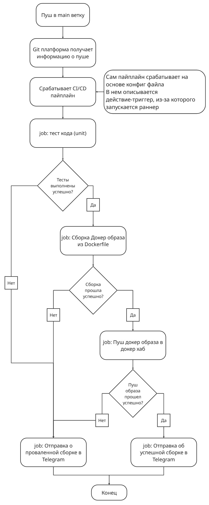

# Тестовое задание DevOps-инженер
## Задание A1: "Собери и запусти" (Docker, Linux, CLI)
**Цель**: Развернуть простое веб-приложение (например, статичный сайт или nginx) с использованием Docker и сделать базовые операции.

Инструкция:
1.	Создай директорию test-project.
2.	Внутри создай файл Dockerfile для образа на основе nginx:alpine. <br>Скопируй в контейнер любой простой index.html файл (можешь создать его с текстом "Hello from [Твое имя]").
3.	Собери образ с тегом my-web-app:latest.
4.	Запусти контейнер из этого образа, пробросив порт 8080 хоста на порт 80 контейнера.
5.	Убедись, что в браузере по адресу http://localhost:8080 открывается твоя страница.
6.	Напиши простой docker-compose.yml файл, который делает то же самое (запускает этот сервис).
7.	Вопрос для размышления: Как можно доставить твой index.html в контейнер, не пересобирая образ?

### Решение
1.	Создай директорию test-project - ✅
2.	Внутри создай файл Dockerfile для образа на основе nginx:alpine - ✅
```Dockerfile
FROM nginx:alpine

# Простое копирование страницы html в контейнер
COPY index.html /usr/share/nginx/html
```
3.	Собери образ с тегом my-web-app:latest - ✅
```cmd
 docker build -t my-web-app .
 ```
 4.	Запусти контейнер из этого образа, пробросив порт 8080 хоста на порт 80 контейнера - ✅
 ```cmd
docker run -d -p 8080:80 --name my-web-app my-web-app
docker ps      
CONTAINER ID   IMAGE        COMMAND                  CREATED         STATUS         PORTS                                     NAMES
cb178f0f7382   my-web-app   "/docker-entrypoint.…"   6 minutes ago   Up 6 minutes   0.0.0.0:8080->80/tcp, [::]:8080->80/tcp   my-web-app
```
5.	Убедись, что в браузере по адресу http://localhost:8080 открывается твоя страница - ✅
```cmd
curl http://localhost:8080
<!DOCTYPE html>
<html lang="en">
<head>
    <meta charset="UTF-8">
    <meta name="viewport" content="width=device-width, initial-scale=1.0">
    <title>Document</title>
</head>
<body>
    <h1>Hello from Daniil!</h1>
</body>
```
6.	Напиши простой docker-compose.yml файл, который делает то же самое (запускает этот сервис) - ✅
```docker-compose.yml
services:
  nginx:
    build: .
    container_name: my-web-app
    ports:
      - "8080:80"
    restart: always
```
```cmd
docker compose up -d
[+] Building 1.5s (10/10) FINISHED
...
[+] Running 3/3
 ✔ test_project-nginx            Built                                                                                                                                                                                            0.0s 
 ✔ Network test_project_default  Created                                                                                                                                                                                          0.0s 
 ✔ Container my-web-app          Started
docker ps
CONTAINER ID   IMAGE                COMMAND                  CREATED         STATUS         PORTS                                     NAMES
ec45c1180ef5   test_project-nginx   "/docker-entrypoint.…"   6 seconds ago   Up 5 seconds   0.0.0.0:8080->80/tcp, [::]:8080->80/tcp   my-web-app
```
Проверка страницы:
```cmd
curl http://localhost:8080
<!DOCTYPE html>
<html lang="en">
<head>
    <meta charset="UTF-8">
    <meta name="viewport" content="width=device-width, initial-scale=1.0">
    <title>Document</title>
</head>
<body>
    <h1>Hello from Daniil!</h1>
</body>
```
7.	Вопрос для размышления: Как можно доставить твой index.html в контейнер, не пересобирая образ? <br>

**Ответ** <br>
Можно создать монтирование файла, но такой подход подходит, как мне кажется, при локальной работе с контейнерами:
1. Команда при запуске контейнера с `docker`:
```docker
docker run -d -p 8080:80 -v "$(pwd)/index.html:/usr/share/nginx/html" --name my-web-app my-web-app
```
2. Команда при запуске контейнера с `docker compose`:
```docker-compose.yml
services:
  nginx:
    build: .
    container_name: my-web-app
    volumes:
      - "./index.html:/usr/share/nginx/html"
    ports:
      - "8080:80"
    restart: always
```
Можно еще при собранном контейнере просто скопировать данный файл **именно** в сам контейнер:
```docker
docker cp ./index.html my-web-app:/usr/share/nginx/html/index.html
```

## Задание B1: "Простой скрипт-помощник" (Bash)
**Задача**: Напиши bash-скрипт clean_old_logs.sh, который:
1.	Принимает два аргумента: путь к директории (/path/to/logs) и количество дней (N).
2.	Находит в указанной директории все файлы с расширением .log, которые старше N дней.
3.	Выводит список этих файлов на экран и запрашивает подтверждение: "Удалить эти файлы? (y/n)".
4.	При подтверждении 'y' — удаляет их. При 'n' — завершает работу.
5.	Если аргументы не переданы, выводит справку по использованию скрипта.

### Решение
```sh
#!/bin/bash

# Переменные
path=$1
days=$2

# Проверка на ввод двух аргументов
if [[ $# -ne 2 ]]; then
    echo "Неправильный ввод аргумента"
    echo "Инструкция использования скрипта:"
    echo "Необходимо написать ./clean_old_logs.sh ПЛЮС /path/to/logs (путь к директории) ПЛЮС количество дней (N)"
    exit 1
# Проверка на непустое значение path, а также проверка дней на целое положительное
elif [[ -n "$path" && "$days" =~ ^[0-9]+$ && "$days" -gt 0 ]]; then
    echo "=== Найденные логи ==="
    find "$path" -type f -name '*.log' -mtime +"$days" 2>/dev/null
else 
    echo "Логи не найдены"
    echo "Неправильный ввод аргумента"
    echo "Инструкция использования скрипта:"
    echo "Необходимо написать ./clean_old_logs.sh ПЛЮС /path/to/logs (путь к директории) ПЛЮС количество дней (N)"
    exit 1
fi

echo -n "Удалить эти файлы? (y/n)"
read answer

# Проверка ответа на y или n, другие значения выдают ошибку
if [ $answer = "y" ]; then 
    echo "Удаляем файлы..."
    # Комбинированная команда, которая так же находит файлы, но теперь удаляет их, благодаря флагу -exec 
    find $path -type f -name '*.log' -mtime +$days -exec rm -f {} \; 2>/dev/null 
    echo "файлы удалены!"
elif [ $answer = "n" ]; then
    echo "Ничего не делаем)"
else
    echo "Неправильный ввод аргумента"
    echo "Инструкция использования скрипта:"
    echo "Необходимо написать ./clean_old_logs.sh ПЛЮС /path/to/logs (путь к директории) ПЛЮС количество дней (N)"
fi
```

## Задание B2: "Маленькая проблема в Git" (Git)
**Ситуация**:
1.	Ты сделал коммиты в ветке feature/junior-task.
2.	Тебе нужно срочно переключиться на main, чтобы поправить баг, но твои текущие изменения не готовы для коммита.
3.	Как сохранить твою незакоммиченную работу, переключиться на main, а потом вернуться к ней?
4.	После возврата в feature/junior-task ты понял, что последний коммит нужно переименовать. Как это сделать?

### Решение
```bash
# 1. Сохранить файлы, которые пока не были закоммичены
git stash
# 2. Переключение на другую ветку
git switch main # или git checkout main
# чиним баг в ветке...
# 3. Переключение на ветку + забрать незакоммиченные наработки
git switch feature/junior-task
git stash pop # применит последний stash и удалит его из списка. Можно не удалять; команда - git stash apply
# 4. Изменение последнего коммита
git commit --amend -m "feat: новый, осмысленный, граматически верный коммит..."
```

## Задание B3: "Объясни концепцию" (Понимание CI/CD)
**Задача**: Представь, что тебе нужно настроить автоматическую сборку Docker-образа из кода в репозитории.
1.	Нарисуй схему (блок-схему) или опиши текстом по шагам, что должно происходить, когда разработчик пушит код в ветку main в GitLab/GitHub.
2.	Включи в схему этапы: "запуск тестов", "сборка образа", "пуш образа в Docker Hub", "уведомление в Telegram об успехе/провале".

### Решение
Общее описание концепции:

